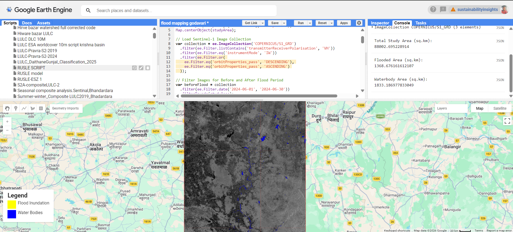
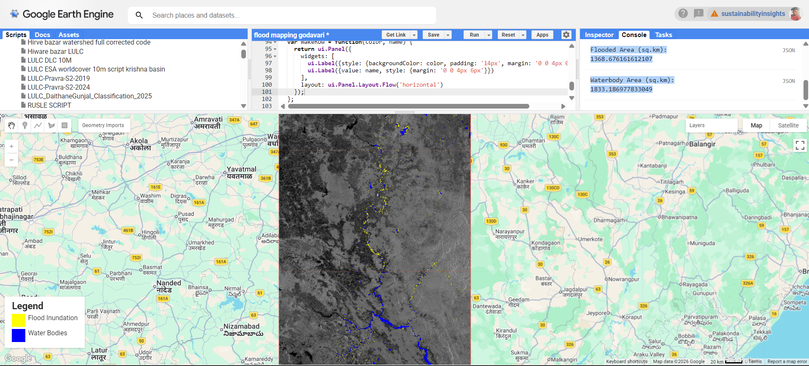

# 🌊 Godavari River Basin Flood Assessment: Sept 2024


**A high-performance geospatial workflow for mapping post-monsoon inundation in the Godavari Basin (Telangana/Maharashtra border).**

This project utilizes **Synthetic Aperture Radar (SAR)** to penetrate the heavy cloud cover of September 2024. Unlike standard scripts, this workflow implements **server-side memory optimization** (`reduceResolution`) to calculate flood extents over large basins without hitting GEE memory limits.

---

## 📊 Dashboard: Quick Look

| **Metric** | **Value** | **Status** |
| :--- | :--- | :--- |
| **Target Region** | Godavari Basin (18°N - 21°N) | 📍 Localized |
| **Sensor** | Sentinel-1 (C-Band SAR) | 🛰️ Active |
| **Polarization** | VH (Vertical-Horizontal) | 📡 Volume Scattering |
| **Event Date** | Sept 09 - Sept 15, 2024 | 🗓️ Post-Monsoon Surge |
| **Algorithm** | Amplitude Thresholding (`< -20dB`) | ⚙️ Optimized |

---

## 🗺️ Visualization

| **Baseline (Pre-Flood)** | **Inundation Extent** |
|:---:|:---:|
|  |  |
| *June 2024 (Dry)* | *Sept 2024 (Wet)* |

### 🔑 Legend
*  **Flood Inundation**: Newly submerged areas (Fields/Settlements).
*  **Permanent Water**: Rivers, Reservoirs, and Lakes.

---

## 🛠️ Technical Innovation: Memory Optimization
Processing large river basins often causes GEE `User Memory Limit Exceeded` errors. This workflow solves this using a **Multi-Scale Aggregation** approach:

1.  **Bitmask Generation**: Flood pixels are identified at native resolution (10m).
2.  **Fractional Aggregation**: Instead of reducing vectors, we use `.reduceResolution()` to compute the *fraction* of flooded pixels within larger 100m coarse pixels.
3.  **Result**: 90% reduction in computational load while maintaining area accuracy.

> 📘 **Read the full Technical Brief:** [docs/tech_brief.md](docs/tech_brief.md)

---

## 🚀 Usage Guide

1.  **Clone the Repo**:
    ```bash
    git clone [https://github.com/yourusername/godavari-flood-watch.git](https://github.com/yourusername/godavari-flood-watch.git)
    ```
2.  **Run in GEE**: Copy `src/godavari_flood.js` into the Code Editor.
3.  **Parameter Tweak**:
    * Adjust `var coarseScale = 100` to `50` for higher precision (slower).
    * Adjust `var coarseScale = 500` for faster, rougher estimates.

---

## 👨‍💻 Author

**[Your Name]**
*Hydraulic Modeler & Geospatial Developer*

*Specializing in large-scale catchment analysis and remote sensing algorithms.*
